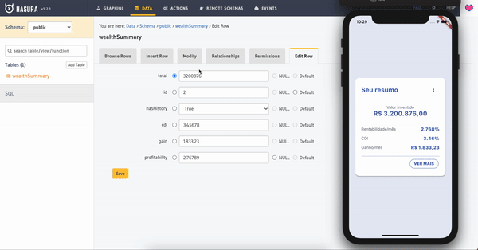
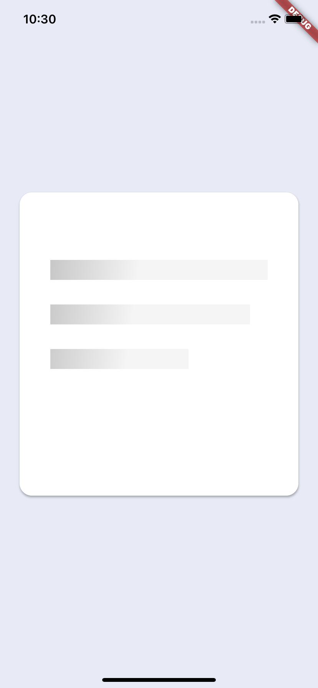
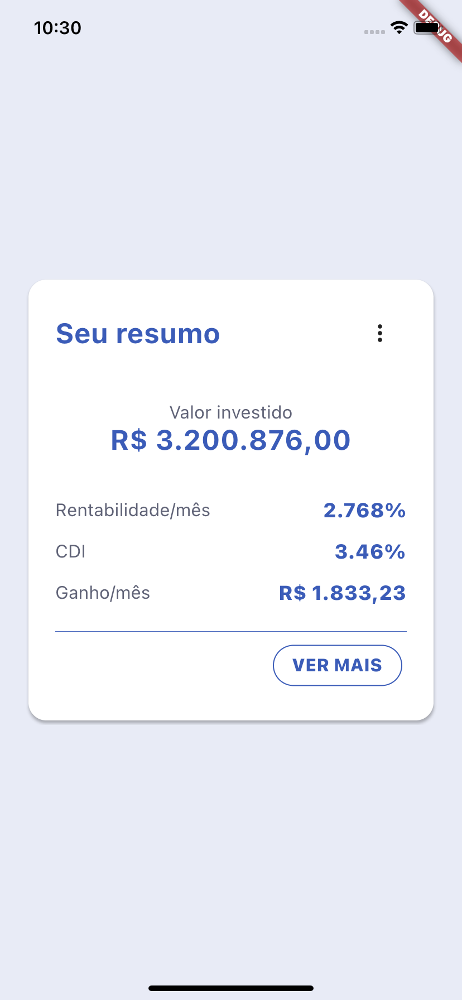

# Challenge Flutter Fliper



| Loading                                                              | Home                                                                |
| -------------------------------------------------------------------- | ------------------------------------------------------------------- |
|  |  |

Este projeto faz parte do desafio técnico, onde é construído um app flutter capaz de consultar uma api [graphql](https://graphql.org/) e exibir os resultados na tela inicial do app.

## Descrição

Este módulo é um dos componentes do app flutter capaz de buscar dados de uma api graphql. É aqui onde os módulos se encontram. Os módulos de serviço, e de ui são importados aqui, para criação do app.
## Como rodar o projeto

Para executar o projeto você precisa ter o [git](https://git-scm.com/book/en/v2/Getting-Started-Installing-Git) instalado. E se você tiver com ele instalado basta executar:

```bash
https://github.com/iranjunior/challenge_app.git # baixar o repositório
flutter pub get
```

E por fim, para rodar o projeto basta executar:

```bash
flutter run
```

